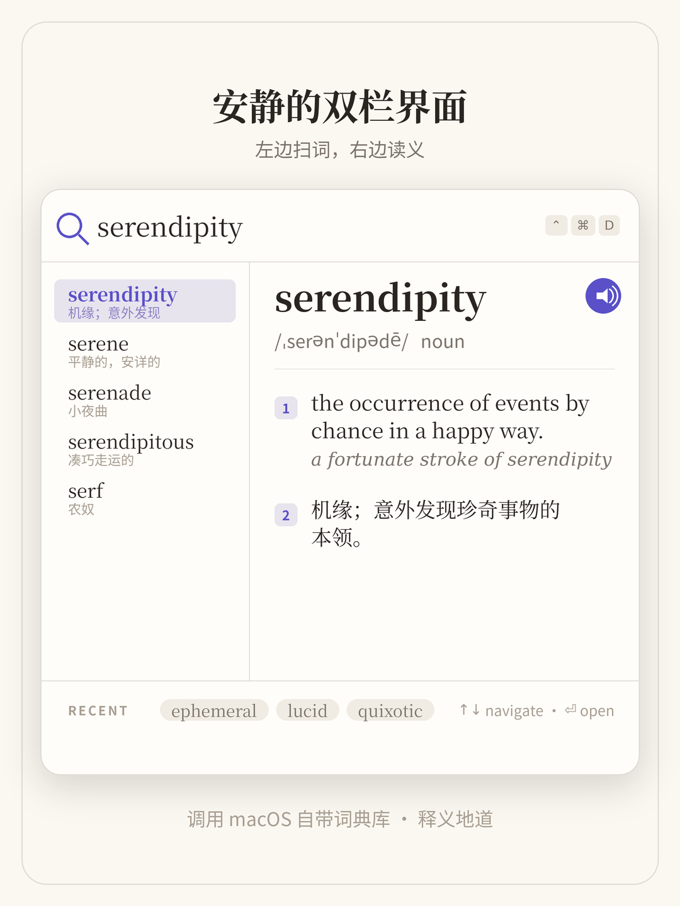
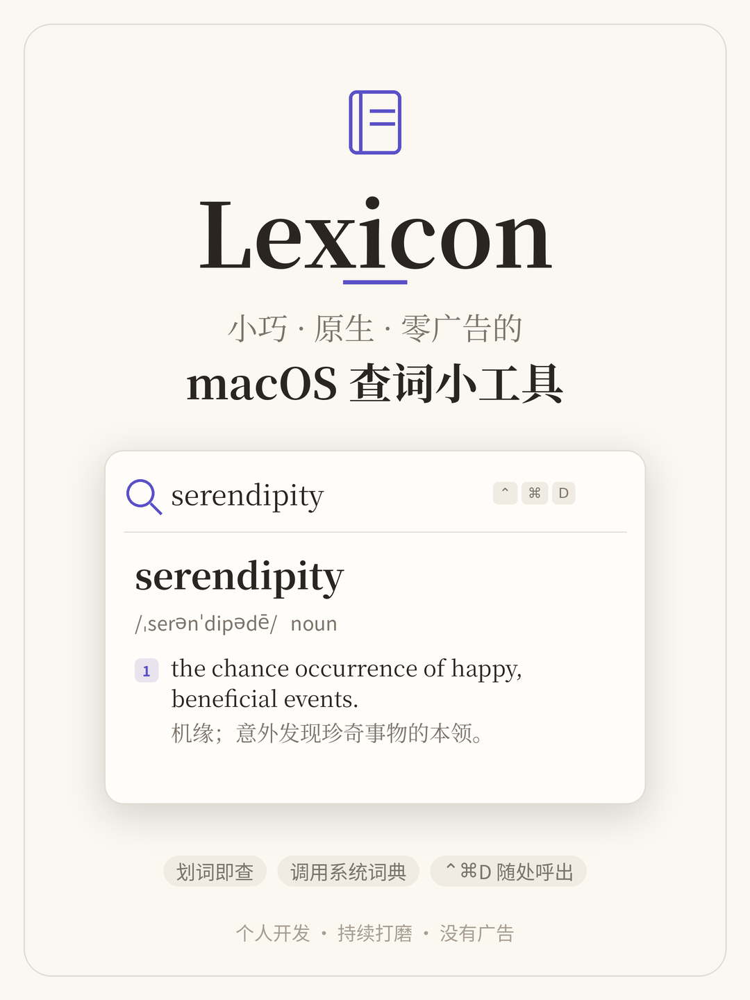
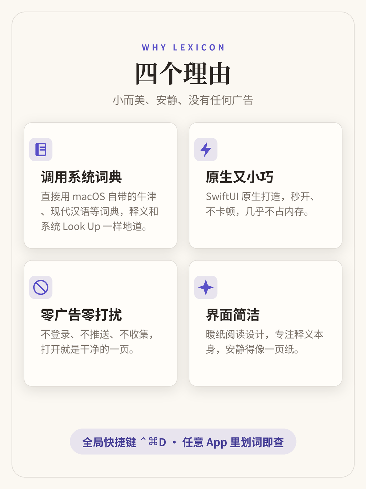

# Lexicon

A small, fast, **native** macOS menu-bar app for looking up words in the Apple dictionaries you already have installed — no ads, no account, no clutter.

一个小巧、原生、界面干净的 macOS 菜单栏查词工具：**直接调用系统自带词典库**，没有任何广告、不用登录。


<p align="center">
  
</p>

---

## 简介 (Chinese intro)

macOS 自带的 **Look Up**（三指轻点 / 右键查词）很好用，但有些场景用不了——某些 App、PDF、终端，或者根本划不中词的时候。第三方查词软件又常常臃肿、带广告、还要登录。

**Lexicon** 的初衷就是做一个**小而美、安静、零广告**的替代：它调用的就是苹果自带的 `DictionaryServices`（和系统 Look Up、`词典.app` 同一套词典库），所以释义一样地道，但可以用全局快捷键 `⌃⌘D` 在任何地方呼出。

- 🪶 **小巧原生** — SwiftUI 打造，秒开、几乎不占资源
- 🌾 **界面简洁** — 暖纸阅读设计，专注释义本身
- 🚫 **零广告零打扰** — 不登录、不推送、不收集
- ⌨️ **全局快捷键 `⌃⌘D`** — 任意 App 里划词即查
- 📚 **系统词典库** — 在「词典.app」里启用的词典都能用（牛津、现代汉语等）

---

## Features

- **Global hotkey** — `⌃⌘D` from anywhere brings up a frosted-glass search panel, Spotlight-style.
- **Menu bar icon** — click the 📖 icon for instant access plus recent lookups and favorites.
- **Look up selected text** — highlight any word in any app, press the hotkey, and the definition appears instantly.
- **Live two-pane search** — a Dictionary.app-style word list on the left (with inline one-line gloss previews) and the full definition on the right, updating as you type (90 ms debounce).
- **Typo-tolerant** — misspelled a word? When nothing matches as a prefix, the system spell-checker offers corrections in a "Did you mean" list (e.g. `seperate` → `separate`).
- **Multiple dictionaries** — tab between every dictionary you have enabled in `Dictionary.app` (New Oxford American, Oxford Thesaurus, Oxford Chinese, Wikipedia, etc.).
- **Pronunciation** — tap the speaker icon to hear the word spoken (uses `AVSpeechSynthesizer`).
- **History & favorites** — every lookup is remembered; star words to keep them around.
- **Warm empty state** — a daily "word of the day" plus your favorites greet you when the panel opens.
- **Keyboard-first** — `↑` / `↓` to browse matches, `↩` to open, with a calm loading shimmer while results resolve.
- **Light & dark mode** — a hand-tuned "Reading Room" theme (Daylight / Lamplight) that re-tints with the system appearance; serif definition text, rounded UI.

## Screenshots

| Reading Room interface | At a glance | Why Lexicon |
|---|---|---|
|  |  |  |

## Project layout

```
Lexicon/
├── project.yml                 # XcodeGen spec — regenerates Lexicon.xcodeproj
├── Lexicon.xcodeproj/          # committed Xcode project (open this directly)
├── Lexicon/
│   ├── Info.plist
│   ├── Lexicon.entitlements
│   ├── LexiconApp.swift
│   ├── AppDelegate.swift
│   ├── App/
│   │   ├── MenuBarController.swift
│   │   ├── HotKeyManager.swift
│   │   ├── PanelController.swift
│   │   └── SelectionService.swift
│   ├── Dictionary/
│   │   ├── DictionaryService.swift
│   │   └── DefinitionModels.swift
│   ├── UI/
│   │   ├── SearchPanelView.swift
│   │   ├── SearchField.swift
│   │   ├── DefinitionView.swift
│   │   ├── DictionaryTabs.swift
│   │   ├── VisualEffectBackground.swift
│   │   └── Theme.swift
│   ├── Storage/
│   │   └── HistoryStore.swift
│   ├── Speech/
│   │   └── Pronouncer.swift
│   ├── Bridging/
│   │   ├── Lexicon-Bridging-Header.h
│   │   └── DictionaryServices+Bridge.h
│   └── Resources/
│       └── Assets.xcassets/
├── docs/screenshots/           # README images
└── README.md
```

## Build & run

> `Lexicon.xcodeproj` is committed, so you can open the project straight after cloning. If you change `project.yml` (add/remove files, tweak settings), regenerate it with XcodeGen.

### Option A — open directly (simplest)

```bash
git clone https://github.com/<your-username>/Lexicon.git
cd Lexicon
open Lexicon.xcodeproj
```

Press ▶ Run in Xcode. The menu bar icon will appear. Press `⌃⌘D` to summon the search panel.

### Option B — regenerate with XcodeGen

```bash
brew install xcodegen           # one-time
xcodegen generate               # rebuilds Lexicon.xcodeproj from project.yml
open Lexicon.xcodeproj
```

### Option C — manual Xcode setup

1. Xcode → **File → New → Project → macOS → App**, name it `Lexicon`, language Swift, interface SwiftUI, deselect "Use Core Data" and "Include Tests".
2. Delete the auto-generated `ContentView.swift` and `LexiconApp.swift`.
3. Drag the entire `Lexicon/` folder from this repo into the Xcode project navigator. When prompted: **Copy items if needed** ✅, **Create groups** ✅.
4. In **Build Settings**, set **Objective-C Bridging Header** to `Lexicon/Bridging/Lexicon-Bridging-Header.h`.
5. In **General → Frameworks**, add **`CoreServices.framework`** (this is where `DictionaryServices` lives).
6. In **Info.plist**, set `Application is agent (UIElement)` = `YES` (so there's no dock icon).
7. Press ▶.

## Permissions

On first launch, macOS will ask for **Accessibility permission**. This is required so Lexicon can read the selected text from the frontmost app when you press the hotkey. Grant it in *System Settings → Privacy & Security → Accessibility*.

(The app works fine without it — you just lose the "look up selected text" shortcut.)

## How it talks to Apple Dictionary

Lexicon uses Apple's private `DictionaryServices.framework` (part of `CoreServices`), the same framework that powers `Dictionary.app` and the system `⌃⌘D` shortcut:

- `DCSCopyAvailableDictionaries()` / `DCSGetActiveDictionaries()` — enumerate the dictionaries the user has enabled.
- `DCSCopyTextDefinition(dict, text, range)` — get a well-formatted plain-text definition, which we parse into sections for nicer rendering.

These APIs are not in the public SDK, so **this app is not suitable for the Mac App Store**. It works perfectly when distributed directly (DMG, Homebrew Cask, etc.).

## Customization

- **Change the hotkey:** edit `defaultKeyCombo` in `HotKeyManager.swift`.
- **Change the panel size:** edit `panelSize` in `PanelController.swift`.
- **Change accent / paper colors:** edit the tokens in `Theme.swift`.
- **Change the word-of-the-day list:** edit `WordOfTheDay.words` in `SearchPanelView.swift`.

## Roadmap

- [ ] Preferences window (custom hotkey, default dictionary, font size)
- [ ] Recent ⇄ Favorites toggle in the results footer
- [ ] Wikipedia rich preview
- [ ] Export favorites to Anki/CSV
- [ ] Inline thesaurus suggestions

## Changelog

Current version: **1.1.0**. See [CHANGELOG.md](CHANGELOG.md) for the full history.

## Contributing

Issues and pull requests are welcome! For larger changes, please open an issue first to discuss what you'd like to do. Code style follows the existing files (SwiftUI, small focused types, comments that explain the *why*).

## License

[MIT](LICENSE) © 2026 Aaron Yang
